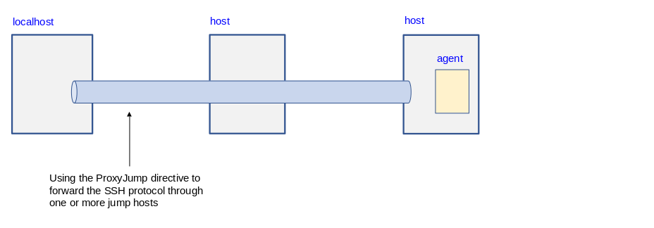

[comment]: <> (how corelib does, and why I choose to design it the way it does it)

# powermole/lib

This package contains building blocks to make an encrypted connection via one or more intermediate hosts possible.
In addition, this package also contains a module named agent which is transferred to the target destination host.
The building block system provide easy scalability.
Use the package **powermolecli** to interact with this library.

## How it works

### Terminology
* **tunnel** is an established connection from localhost to the target destination host through intermediate hosts (called Gateways).
* **agent** is a python module running on the target destination host. It performs various functions.
* **agent assistant** sends data and instructions to the *agent* by using a forwarded connection.

The program uses SSH to connect to the target destination host via one or more intermediaries.

Through port forwarding, the program can communicate with the agent on the target destination host.

The agent assistant in conjuction with the agent provides four modes:

 * TOR mode
 * FOR(warding) mode
 * INTERACTIVE mode
 * FILE mode

See [cli](https://github.com/yutanicorp/powermolecli) package for applications (uses).

## Development Workflow

The workflow supports the following steps

 * lint
 * test
 * build
 * document
 * upload
 * graph

These actions are supported out of the box by the corresponding scripts under _CI/scripts directory with sane defaults based on best practices.
Sourcing setup_aliases.ps1 for windows powershell or setup_aliases.sh in bash on Mac or Linux will provide with handy aliases for the shell of all those commands prepended with an underscore.

The bootstrap script creates a .venv directory inside the project directory hosting the virtual environment. It uses pipenv for that.
It is called by all other scripts before they do anything. So one could simple start by calling _lint and that would set up everything before it tried to actually lint the project

Once the code is ready to be delivered the _tag script should be called accepting one of three arguments, patch, minor, major following the semantic versioning scheme.
So for the initial delivery one would call

    $ _tag --minor

which would bump the version of the project to 0.1.0 tag it in git and do a push and also ask for the change and automagically update HISTORY.rst with the version and the change provided.

So the full workflow after git is initialized is:

 * repeat as necessary (of course it could be test - code - lint :) )
   * code
   * lint
   * test
 * commit and push
 * develop more through the code-lint-test cycle
 * tag (with the appropriate argument)
 * build
 * upload (if you want to host your package in pypi)
 * document (of course this could be run at any point)

## Important Information

This template is based on pipenv. In order to be compatible with requirements.txt so the actual created package can be used by any part of the existing python ecosystem some hacks were needed.
So when building a package out of this **do not** simple call

    $ python setup.py sdist bdist_egg

**as this will produce an unusable artifact with files missing.**
Instead use the provided build and upload scripts that create all the necessary files in the artifact.

## Documentation

* Documentation: https://powermolelib.readthedocs.org/en/latest

## Contributing

Please read [CONTRIBUTING.md](https://gist.github.com/PurpleBooth/b24679402957c63ec426) for details on our code of conduct, and the process for submitting pull requests to us.

## Authors

* **Vincent Schouten** - *Initial work* - [LINK](https://github.com/powermolelib)

See also the list of [contributors](https://github.com/your/project/contributors) who participated in this project.

## License

This project is licensed under the MIT License - see the [LICENSE.md](LICENSE.md) file for details

## Acknowledgments

* Costas Tyfoxylos
* MisterDaneel (developer of pysoxy)
